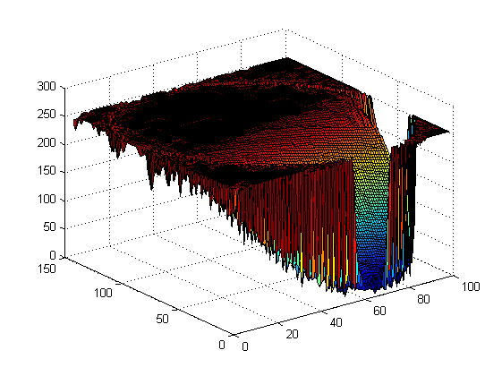
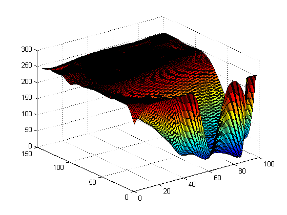
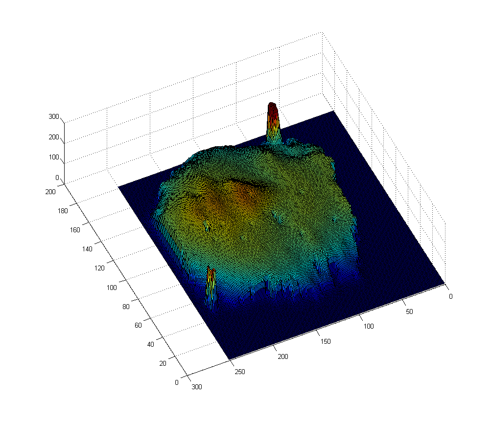
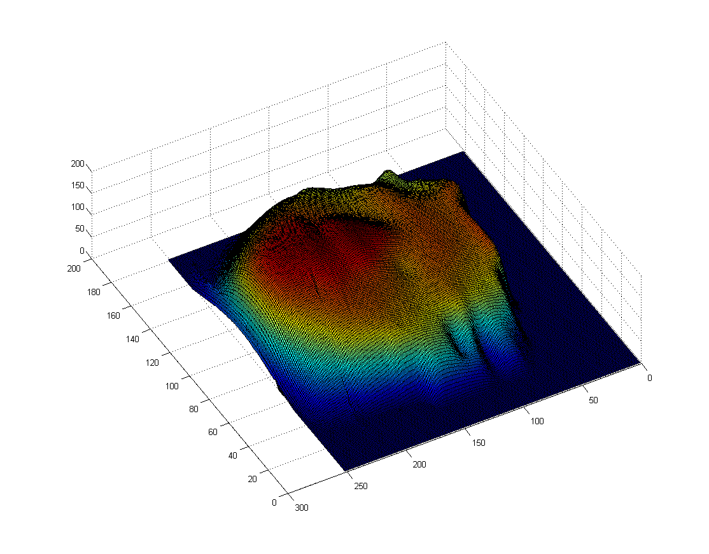
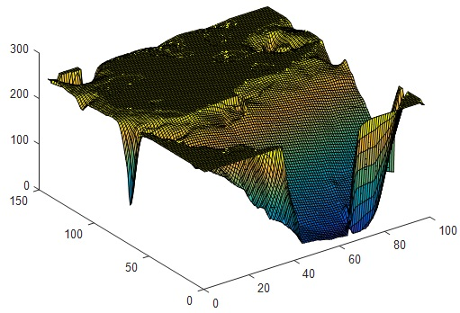

# MLS(moving least-squares)

移动最小二乘的二维曲面的拟合

moving least-squares for surface fitting

## Cpp version

simple 2-d image fitting and human face fitting example.

PS: It's an initial draft, no efficient enouth.(small image input is faster.)

### simple 2-d image fitting

Top is the orignial image on the left and it's 3-d image shown in Matlab on the right.

Botton it the mls output image and it's 3-d image shown in Matlab on the right.

### face  depth image fitting

Top is the orignial face depth image on the left and it's 3-d image shown in Matlab on the right.

Botton it the mls output face depth image and it's 3-d image shown in Matlab on the right.

## Matlab version

origin image:

after fitting:

# Reference：
[1].[Moving Least-squares for surface fitting](https://loopvoid.github.io/2019/10/21/%E7%A7%BB%E5%8A%A8%E6%9C%80%E5%B0%8F%E4%BA%8C%E4%B9%98%E7%9A%84%E6%9B%B2%E7%BA%BF%E6%9B%B2%E9%9D%A2%E6%8B%9F%E5%90%88/)

[2].[基于移动最小二乘法的曲线曲面拟合_曾清红](https://wenku.baidu.com/view/fe7a74976f1aff00bed51eb1.html)

[3].[深入理解移动最小二乘法曲面拟合](https://blog.csdn.net/liumangmao1314/article/details/89421806)

[4].[移动最小二乘法（MLS）曲线曲面拟合](https://blog.csdn.net/liumangmao1314/article/details/54179526)

[5].[移动最小二乘法在点云平滑和重采样中的应用](https://www.cnblogs.com/zhouzekai/p/10468502.html)

[6].[基于移动最小二乘法的曲线曲面拟合(python语言实现)](https://blog.csdn.net/baidu_38127162/article/details/82380914)

[7].[MLS（移动最小二乘）](https://blog.csdn.net/weixin_41484240/article/details/81204113)
